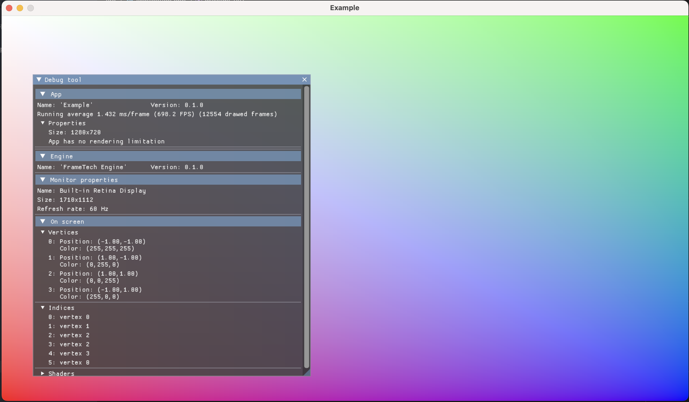

# FrameTech

An example of a game and the custom `FrameTech` engine.

**This project is not compatible with a Vulkan SDK > 1.3.211.**

This repository includes:

1. a simple application (game),
2. a custom standard library for FrameTech, called `ftstd`,
3. a custom engine called `FrameTech`.

The custom standard library, `ftstd` (for "FrameTech STanDard library"), is enough to run and debug the engine only, and has no purpose to run in PRODUCTION mode for the moment.

This engine is divided in several namespaces, or parts, like `Graphics`.

## About externs

This repository includes extern repositories / dependencies, like `imgui` or `glm` (for shaders specifications).  
Do not forget to run a `git submodule update` after cloning the _FrameTech_ repository.  
Thanks to Omar Cornut & the ImGui team for providing a such great tool for free, to the developers.

## Screenshots

## TODO

1. Improve the shaders bindings,
2. Make a todo statement about what to move from pipeline / render / swapchain / ... to ...,
3. Make the configuration external to the build (like FPS limit),
4. Multi-platforms.
