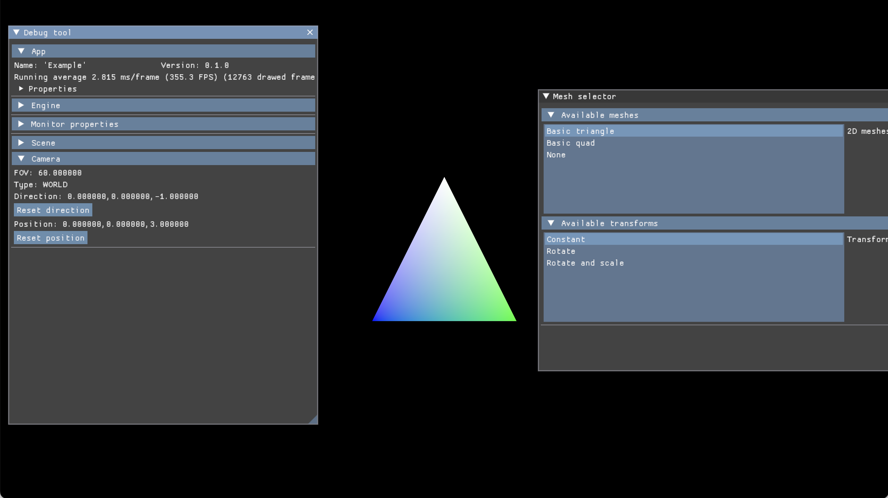

# FrameTech

An example of a game and a custom rendering engine, using **Vulkan**.

This engine **does not** support any other graphics API than Vulkan.

**This project is not compatible with Vulkan SDK > 1.3.211.**

This repository includes:

1. a simple application,
2. the rendering engine (`frametech`),
3. a custom standard library (`ftstd`),

The custom standard library, `ftstd` (for "FrameTech STanDard library"), is enough to run and debug the engine only, and has no ambition to be pushed in production.

`FrameTech` has no ambition to be pushed in production either.

## Compatibily

* macOS on Apple Silicon / Intel chips,
* Windows 10/11 with a dedicated graphics card and Vulkan enabled.

## About externs

This repository includes extern repositories / dependencies, like `imgui`, `vma`, or `glm`.
I tend to avoid git submodules as much as possible, so this repository contains everything to build and run the application.

The Vulkan engine uses `VMA` as memory allocator dependency. 

Thanks to the ImGui and GLM teams for providing such great tools for free.

## Build

Create an empty directory like `out/build` in the root of the project.

Now, build the Makefiles using cmake like this: `cmake -S ../../ -B . -DCMAKE_BUILD_TYPE=Debug -T ClangCL`.

The project is compatible with:
* Visual Studio 2022 (`-G "Visual Studio 17 2022"`),
* Xcode (`-G Xcode`)

I **did not** try MSVC to compile the project but it should works (however you may have to tweak the compiler's 
options).

Once the Makefiles have been built, go in your `out/build` folder and launch make,
 or open your project in Visual Studio for Microsoft Windows.

## Screenshots

## TODO

1. Multiple buffers allocation using **one** _VkBuffer_ only,
2. Improve the shaders bindings,
3. Make a todo statement about what to move from pipeline / render / swapchain / ... to ...,
4. Make the configuration external to the build (like FPS limit),
